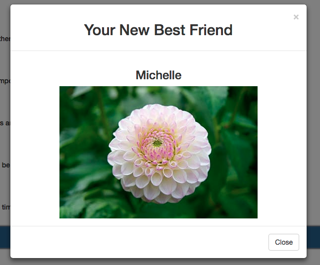

# Welcome To FriendFinder 

Heroku: 
https://nameless-journey-80492.herokuapp.com/

Node packages used:
* Express
* Body-Parser

### Getting Started
You will be asked 10 different questions including: 

1. Your mind is always buzzing with unexplored ideas and plans.
2. Generally speaking, you rely more on your experience than your imagination.
3. You find it easy to stay relaxed and focused even when there is some pressure.
4. You rarely do something just out of sheer curiosity.
5. People can rarely upset you.
6. It is often difficult for you to relate to other people’s feelings.
7. In a discussion, truth should be more important than people’s sensitivities.
8. You rarely get carried away by fantasies and ideas.
9. You think that everyone’s views should be respected regardless of whether they    are supported by facts or not.
10. You feel more energetic after spending time with a group of people.

After completing you will be matched with the best matched friend

You will then be added to the friends array which can be viewed at `/api/friends` or by clicking the link

